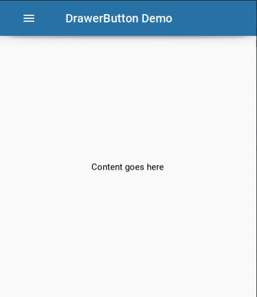
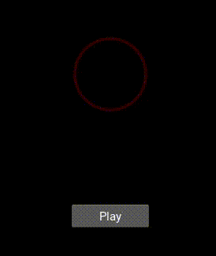

# AndroidView
A repository to contain android view animations created using [Kivy](https://github.com/kivy/kivy)

WidgetAnimator:
--------------------
* Runnning demo script requires [Kivy](https://github.com/kivy/kivy) and [KivyMD](https://github.com/HeaTTheatR/KivyMD) to be installed. However, using `Animator` isn't dependent upon KivyMD.

DrawerButton:                             
-------------

WirelessRippleButton demo
------------------------

SuccessAnim &nbsp; &nbsp; &nbsp; &nbsp; &nbsp; &nbsp; &nbsp; &nbsp; &nbsp; &nbsp; &nbsp; &nbsp; &nbsp; &nbsp; &nbsp; &nbsp; &nbsp; &nbsp; &nbsp; &nbsp; &nbsp; FailureAnim:
------------

                          

#### Dependencies:
* [Kivy](https://github.com/kivy/kivy)
* [KivyMD](https://github.com/HeaTTheatR/KivyMD)
* Python 3 (Obviously)

#### How to use?:
* Currently no docs are avilable so kindly stick to demos for usages.
